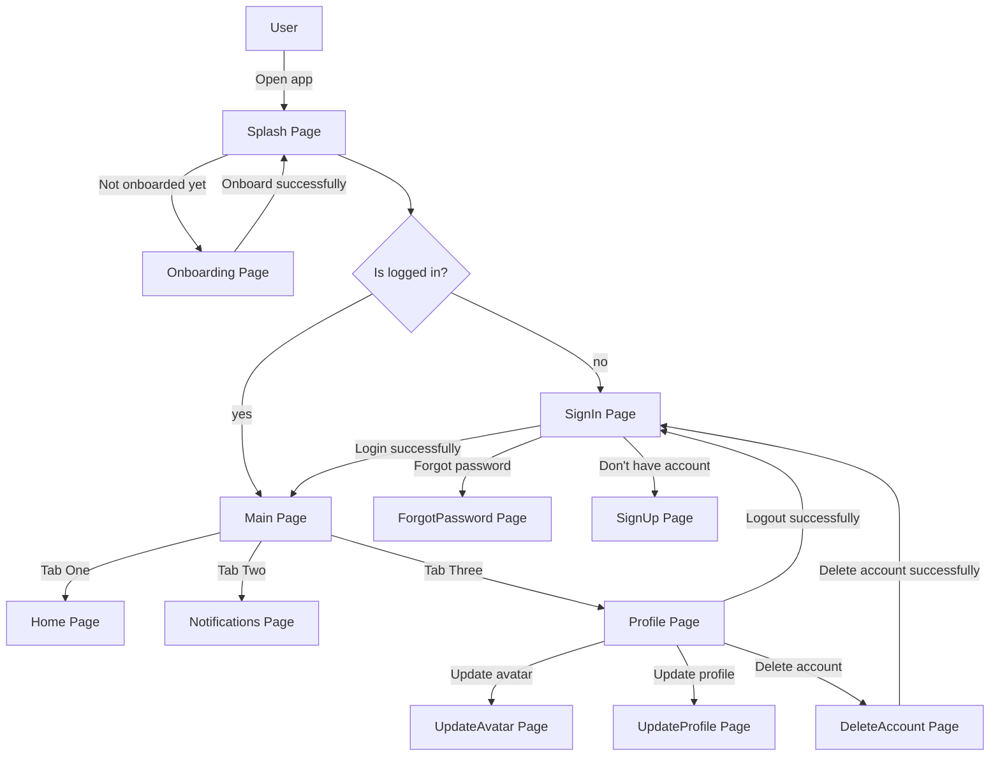
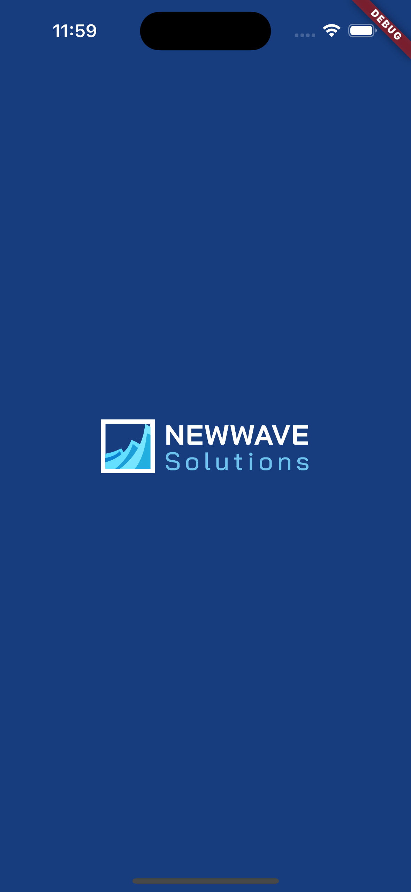
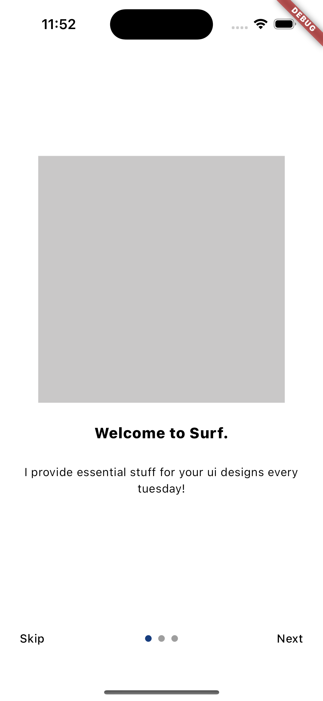
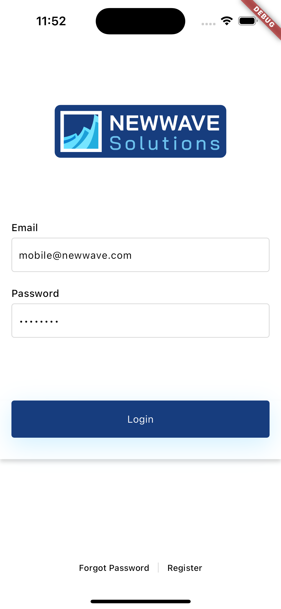
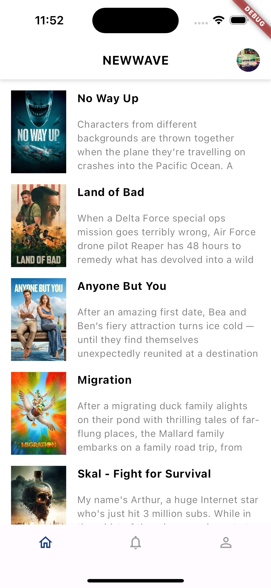

# App Screens
## Screen flows

```mermaid
flowchart TD
    A[User] -->|Open app| B[Splash Page]
    B -->|Not onboarded yet| O[Onboarding Page]
    B -->C{Is logged in?}
    O -->|Onboard successfully| B
    C -->|no| D[SignIn Page]
    C -->|yes| E[Main Page]
    D -->|Forgot password| F[ForgotPassword Page]
    D -->|Don't have account| G[SignUp Page]
    D -->|Login successfully| E
    E -->|Tab One| H[Home Page]
    E -->|Tab Two| I[Notifications Page]
    E -->|Tab Three| K[Profile Page]
    K -->|Logout successfully| D
    K -->|Update avatar| L[UpdateAvatar Page]
    K -->|Update profile| M[UpdateProfile Page]
    K -->|Delete account| N[DeleteAccount Page]
    N -->|Delete account successfully| D
```
## Screen UI
**Start**

    
    

**Auth**

    

**Home**

    

**Profile**

**Notification**
